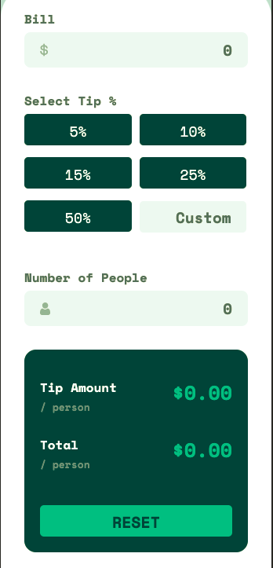

## The Bill Splitter

## Table of contents

- [Overview](#overview)
  - [The challenge](#the-challenge)
  - [Screenshot](#screenshot)
  - [Links](#links)
- [My process](#my-process)
  - [Built with](#built-with)
  - [What I learned](#what-i-learned)
  - [Continued development](#continued-development)
  - [Useful resources](#useful-resources)
- [Author](#author)
- [Acknowledgments](#acknowledgments)


## Overview

### The challenge

Users should be able to:

- View the optimal layout for the app depending on their device's screen size
- See hover states for all interactive elements on the page
- Calculate the correct tip and total cost of the bill per person

### Screenshot





### Links

- Solution URL: [Solution Rep](https://your-solution-url.com)
- Live Site URL: [Live Site](https://your-live-site-url.com)

## About
 An Open Source web application which uses the information provided by the user to
 calculate the tip and total amount per person i.e. the Bill Splitter.
 Made for the ease of the convinience of the user, the UI is user-friendly and 
 easy to use interface.

### Built with

- Semantic HTML5 markup
- CSS custom properties
- Flexbox
- Media Query
- Mobile-first workflow
- Vanilla JavaScript
- VSCode


### What I learned

This was a really helpful project. Though I was comfortable using HTML and CSS, JavaScript was a bit scrampy.
I'll be making changes to this project soon.

```html
<h1>Some HTML code I'm proud of</h1>
```
```css
.calculator #no-of-people {
    background-image: url(images/icon-person.svg);
    background-repeat: no-repeat;
    background-position: left 20px center;
}
.calculator form {
    position: relative;
}
.calculator form label {
    position: absolute;
    right: 5px;
    bottom: 52px;
    font-size: 14px;
}
```
```js
if(peopleNumber.value === 0 || peopleNumber.value == "") {
          peopleNumber.style.border = "1px solid red";
          error.classList.remove("error");
          tipAmount.innerHTML = "$0.00";
          totalTip.innerHTML = "$0.00";
      }
      else {
        tipAmount.innerHTML = "$" + tipPerPerson.toFixed(2);
        totalAmount.innerHTML = "$" + totalTip.toFixed(2);
        peopleNumber.style.border = "none";
        error.classList.add("error");
      }
}
```


### Continued development

Since I'm not quite comfortable with JavaScript therefore I will be working more
on JavaScript based Projects.


### Useful resources

- [Input Events](https://developer.mozilla.org/en-US/docs/Web/API/HTMLElement/input_event) - This helped me in understanding events related to input fields.
- [Mouse Events](https://javascript.info/mousemove-mouseover-mouseout-mouseenter-mouseleave) - This is an amazing article which helped me understand mouseover and mouseout events. I'd recommend it to anyone still learning this concept.


## Author

- Website - [Saurav Srivastava](https://github.com/Sauravionic)
- Frontend Mentor - [@Sauravionic](https://www.frontendmentor.io/profile/Sauravionic)
- LinkedIn - [Saurav Srivastava](https://www.linkedin.com/in/saurav-srivastava-4b71b5188/)


